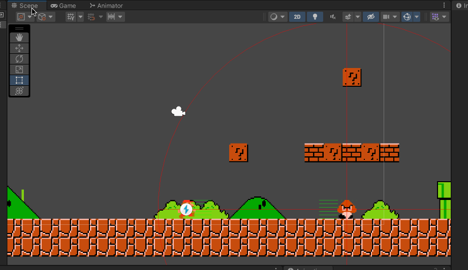
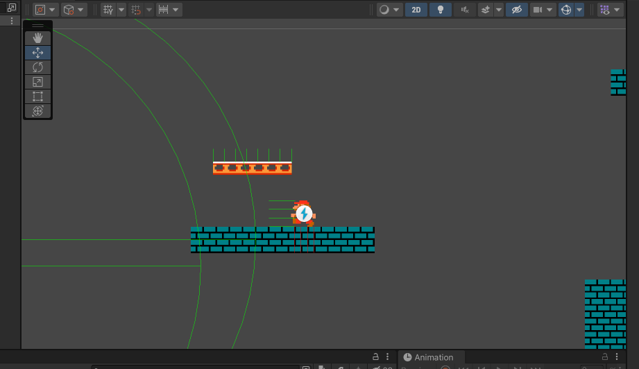

The repository contains a version of Super Mario made in Unity.

The goal of this repository is for me to learn Unity while tweaking the first video game I ever played.

A lot of the algorithms are coming from the following tutorials:

[Sebastian Lague's Creating a 2D platformer series (EN)](https://www.youtube.com/watch?v=MbWK8bCAU2w&list=PLFt_AvWsXl0f0hqURlhyIoAabKPgRsqjz&index=1)

[TUTO UNITY FR's Créer un jeu en 2D facilement avec Unity series (FR)](https://www.youtube.com/watch?v=Y3-iYIs16TI&list=PLUWxWDlz8PYKnrd27LTqOxL2lr3KhEVRT)

## Player

### Jump

I used Sebastian's raycast approach to detect obstacles. 

#### Cooldown

When jumping, I realized there was a problem if Mario was hitting walls. Mario would get extra jump mid-air.

I have implemented a basic cooldown system. As soon as the player jumps and gets off the ground, the [JumpCooldown](Assets/Scripts/Services/Jumps/JumpCooldown.cs) class activates the cooldown. As soon as the player 'hits' ground, it counts the number of frames during which the player is not allowed to jump.

## Enemies

I was curious to know how the game would feel if the enemies were a bit more smarter and actually would try to *get* you.

### Goombas

#### Death

Goombas can be killed if the player touches them from above.

#### Strategies

Goombas have different strategies to attack the player. 

By default, they will not move until the player reaches a certain distance. And when the player gets too close, Goombas will pursue the player until the enemy catches the player or the player is too far away.

To throw the player off a bit, Goombas can do jump scares if the player is really close.

Goombas have the ability to jump over an obstacle if it prevents them from pursuing the player. 

## Platforms

